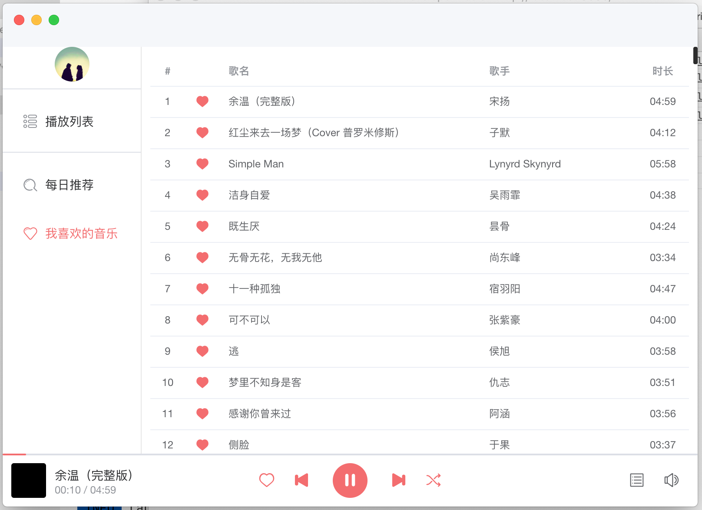

<h1 align="center">Welcome to ears-client 👋</h1>
<p>
  
</p>

> 基于 [electron](https://github.com/electron/electron) && [vue](https://github.com/vuejs/vue) 开发的网易云音乐同步听歌客户端
> 用户情侣之间同步听歌

## Feature

- [x] 播放器
- [x] 网易云歌单
- [ ] 匹配同步听歌

> 更多详细的开发计划 可以看这里 [ears v0.1 todo](https://github.com/JasKang/ears-client/projects/1)

## screenshots



## Install

```sh
# npm install
```

## 🤝 Contributing

Contributions, issues and feature requests are welcome!<br />Feel free to check [issues page](https://github.com/JasKang/ears-client/issues).

## Show your support

Give a ⭐️ if this project helped you!
